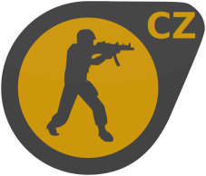
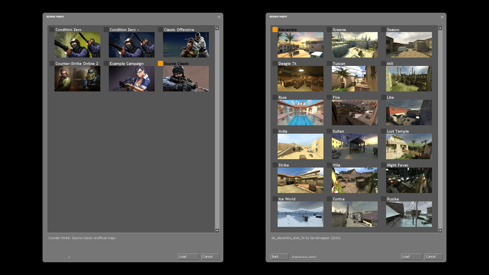

# 

Singleplayer and cooperative PvE mod for **Counter-Strike: Source**, that brings mission based gameplay experience from **Counter-Strike: Condition Zero**

### [ Condition Zero: Source 1.1 - Windows Installer](https://github.com/MuxaJlbl4/Condition-Zero-Source/releases/download/1.1/Condition-Zero-Source-1.1.exe)

### [ Additional Campaigns](https://gamebanana.com/mods/cats/45201)

## ✨ Features

- 🏆 Task tracking system from **Counter-Strike: Condition Zero**
- 👯‍♀️ Multiplayer support and co-op difficulty adjustments
- 🎁 Support for custom maps and campaigns
- 🤖 Ability to play as a bot after death
- 🛒 Auto-buy task weapons on `F1`
- 🎖️ **CS:S** achievements availability
- 🎭 Both **CT** & **T** teams playability
- 🎲 Random mission generator
- ➕ Additional task variations
- 💪 Four difficulty levels
- 🎨 Campaign editor

## 📝 Notes

- 🟠 Powered by [SourceMod](https://www.sourcemod.net/about.php)
- ⚙️ Tested with **v93** ([x64 update](https://steamdb.info/depot/232331/history/?changeid=M:4432809338483152243))
- 👍 Uses [Bot2Player](https://forums.alliedmods.net/showthread.php?t=215830) plugin by [Bittersweet](https://forums.alliedmods.net/member.php?u=181976) - press `E` while spectating any bot-teammate
- ⚠️ Some original game features are simplified:
	- 👥 No ability to assemble team - Difficulty based team composition with predefined count and tasks
	- 🗺️ Based on official **CS:S** maps - Download [Condition Zero +](https://gamebanana.com/mods/672635) for missed **CS:CZ** maps
	- 🔓 No progress saving - All missions are unlocked
	- 🛡️ No shields - Shield tasks replaced with pistols

## 📷 Screenshots


Game menu and mission browser
<br><br><br>

Difficulty and team selection
<br><br><br>

Campaign task tracking
<br><br><br>

Random generated mission
<br><br><br>

Custom missions

## 💾 Installation

### 🪟 Windows

1. Install clean [Counter-Strike: Source](https://store.steampowered.com/app/240/CounterStrike_Source)
2. Install [Condition-Zero-Source.exe](https://github.com/MuxaJlbl4/Condition-Zero-Source/releases/download/1.1/Condition-Zero-Source-1.1.exe) to your `cstrike` folder
3. Set `-insecure` launch option for **Counter-Strike: Source** via **Steam** [game properties](Images/insecure.png)
4. Start **Counter-Strike: Source**

### 🐧 Linux

- **Note:** Network connection required for **Metamod** and **SourceMod** downloading

1. Install clean [Counter-Strike: Source](https://store.steampowered.com/app/240/CounterStrike_Source)
2. Clone this repository: `git clone https://github.com/MuxaJlbl4/Condition-Zero-Source.git`
3. Run `Installer.sh` with path to your `cstrike` folder as argument: `./Installer.sh "/path/to/your/cstrike/"`
4. Start **Counter-Strike: Source** with `-insecure` [launch option](Images/insecure.png)

## 🌍 Multiplayer

1. Start any mission
2. Everyone in your **LAN** can join to you by `connect <IP>`:
	- For non-local players: Use [Tailscale](https://tailscale.com/download), [Hamachi](https://vpn.net) or etc. to create virtual **LAN** 
	- For custom missions: Clients should have installed required map pack

Additional multiplayer options:

- `sv_lan` - Can help with connection problems
- `sv_password` - Password protection for private game (`password` for clients)
- See [Coop Commands](#coop-commands) for additional gameplay adjustments

## 📜 Game Menu

- **Play Counter-Strike: Condition Zero** - Choose campaign to play
- **Start Random Mission** - Choose map to play with random tasks
- **Active Tasks** - Show current task status
- **Give Up This Round** - Skip current round

## 💻 Console Commands

### Task Commands

- `cz_task_add` - Add a new task (see [Task Arguments](#%EF%B8%8F⃣-task-arguments))
- `cz_task_reset` - Reset all task progress
- `cz_skip` - Forces round end with opposite team win
- `cz_list` - List all active achievement tasks

### Coop Commands

- `cz_bots_per_player` - Number of enemy bots that will be added with each joined extra player (default **1**)
- `cz_simple_coop` - Simplified survival and in-a-row tasks for coop (default **1**)

### Initialisation Commands

Initial values for mission `cfg` files:

- `cz_matchwins` - Minimum number of rounds a team must win in order to win a match (default **3**)
- `cz_matchwinsby` - Number of wins a team must lead by in order to win a match (default **2**)
- `cz_teammates` - Number of teammate bots
- `cz_opponents` - Number of enemy bots
- `cz_simple_hegren` - Increases max grenade count in inventory for missions with `hegrenade` task (default **1**)

### Cheat Commands

Available with `sv_cheats 1`:

- `cz_victory` - Force match victory
- `cz_defeat` - Force match defeat

### Debug Commands

- `cz_teamchosen` - Is team and difficulty already chosen for this session
- `cz_task_delete` - Delete all tasks
- `cz_version` - Plugin version


## #️⃣ Task Arguments

Usage: **`cz_task_add <type> [arguments]`** - Add mission task

### Task Types

- ⚡ **kill** - Kill a specified amount of enemies:
	- `cz_task_add kill <target> [headshot] [inarow] [survive] [noreload]`

- 🔫 **killwith** - Kill a specified amount of enemies with mentioned weapon (see [Task Weapons](#task-weapons) section):
	- `cz_task_add killwith <target> <weapon> [headshot] [inarow] [survive] [noreload]`

- 👀 **killblind** - Kill a specified amount of blindfolded enemies:
	- `cz_task_add killblind <target> [headshot] [inarow] [survive] [noreload]`

- ⏱️ **winfast** - Win a round in less than the specified amount of seconds:
	- `cz_task_add winfast <target> [survive]`

- 🏃‍♂️ **rescue** - Rescue a specified amount of hostages:
	- `cz_task_add rescue <target>`

- 🏃‍♀️ **rescueall** - Win a round by rescuing all hostages:
	- `cz_task_add rescueall`

- 💣 **bomb** - Plant/Defuse the bomb
	- `cz_task_add bomb`

- 🔇 **killsilent** - Kill a specified amount of enemies with silenced weapon or knife
	- `cz_task_add killsilent <target> [headshot] [inarow] [survive] [noreload]`

- 🎯 **killnoscope** - Kill a specified amount of enemies with an un-zoomed sniper rifle
	- `cz_task_add killnoscope <target> [headshot] [inarow] [survive] [noreload]`

- 🪽 **killjump** - Kill a specified amount of enemies while you are airborne
	- `cz_task_add killjump <target> [headshot] [inarow] [survive] [noreload]`

- 🔄 **killvary** - Kill a specified amount of enemies with different weapons
	- `cz_task_add killvary <target> [headshot] [inarow] [survive] [noreload]`

- 🏆 **killtrophy** - Kill a specified amount of enemies with enemy's exclusive weapon (see [Exclusive Weapons](#exclusive-weapons) section):
	- `cz_task_add killtrophy <target> [headshot] [inarow] [survive] [noreload]`

- 🩸 **damage** - Deal a specified amount of damage for enemies
	- `cz_task_add damage <target> [headshot] [inarow] [survive] [noreload]`

- 💉 **damagewith** - Deal a specified amount of damage for enemies with mentioned weapon
	- `cz_task_add damagewith <target> <weapon> [headshot] [inarow] [survive] [noreload]`

- 🎨 **spray** - Tag a specified amount of decals
	- `cz_task_add spray <target>`

### Additional Conditions

- 😎 **headshot** - Task counts only with headshot kill

- 👯‍♀️ **inarow** - Uncompleted task resets, when player dies

- ❤️ **survive** - Task counts only when player survives till round end

- ⌛ **noreload** - Uncompleted task resets, when player reloads any weapon

### Task Weapons

- Names:

	- **glock** - 9x19mm Sidearm (Glock 19)
	- **usp** - K&M .45 Tactical (H&K USP Tactical)
	- **p228** - 228 Compact (SIG P228)
	- **deagle** - Night Hawk .50c (Desert Eagle)
	- **elite** - .40 Dual Elites (Dual Berettas)
	- **fiveseven** - ES Five-Seven (FN Five-seveN)
	- **m3** - Leone 12 Gauge (Benelli M3 Super 90)
	- **xm1014** - Leone YG1265 Auto (Benelli M4 Super 90)
	- **galil** - IDF Defender (IMI Galil AR)
	- **ak47** - CV-47 (AK-47)
	- **scout** - Schmidt Scout (Steyr Scout)
	- **sg552** - Krieg 552 (SIG SG 552 Commando)
	- **awp** - Magnum Sniper Rifle (AWP)
	- **g3sg1** - D3/AU-1 (H&K G3SG/1)
	- **famas** - Clarion 5.56 (FAMAS F1)
	- **m4a1** - Maverick M4A1 Carbine (M4A1 Carbine)
	- **aug** - Bullpup (Steyr AUG)
	- **sg550** - Krieg 550 Commando (SIG SG 550)
	- **mac10** - Ingram Mac-10 (Ingram MAC-10)
	- **tmp** - Schmidt Machine Pistol (Steyr TMP)
	- **mp5navy** - K&M Sub-Machine Gun (H&K MP5N)
	- **ump45** - K&M UMP45 (H&K UMP45)
	- **p90** - ES C90 (FN P90)
	- **m249** - M249 (FN Minimi)
	- **hegrenade** - HE Grenade
	- **knife** - Combat Knife

- Classes:

	- **pistol** - `glock` `usp` `p228` `deagle` `elite` `fiveseven`
	- **shotgun** - `m3` `xm1014`
	- **smg** - `tmp` `mac10` `mp5navy` `ump45` `p90`
	- **rifle** - `galil` `famas` `m4a1` `ak47` `aug` `sg552`
	- **sniper** - `scout` `sg550` `g3sg1` `awp`
	- **machinegun** - `m249`

### Exclusive Weapons

Some task weapons automatically swaps depending on player team side:

| **CT** | **T** |
| --- | --- |
| `fiveseven` | `elite` |
| `tmp` | `mac10` |
| `famas` | `galil` |
| `m4a1` | `ak47` |
| `aug` | `sg552` |
| `sg550` | `g3sg1` |

These weapons also counts as "enemy's exclusive" for `killtrophy` task

## ✏️ Creating Custom Campaign

1. In the `Editor` folder create a `txt` file with your campaign name as a filename (`My Campaign.txt`), it should contain ordered map names:

```
cs_havana
cs_italy
```

2. Run `Generator.py` this will create folder with your campaign name and necessary files

3. Put your custom maps, navs and all necessary files to `my_campaign\maps`

4. If required, put your additional map models, materials, folders and etc to `my_campaign`

5. In `my_campaign` create logo for your campaign (`TGA` `180x100`):
- `my_campaign.tga`

6. In `my_campaign\maps` create logos for maps (`TGA` `180x100`):
- `cs_havana.tga`
- `cs_italy.tga`

7. Adjust mission tasks and cvars by editing generated `cfg` files in `my_campaign\cfg\my_campaign`:
- `campaign.cfg`
- `cs_havana.cfg`
- `cs_italy.cfg`

8. Adjust mission names and descriptions by editing generated `bms` files in `my_campaign\maps\my_campaign`

9. If required, create and adjust `my_campaign\cfg\my_campaign\botprofile.db` for custom bot specs

10. Copy `my_campaign` folder to `...\Steam\steamapps\common\Counter-Strike Source\cstrike\custom`, your campaign should appear in game mission browser

Also you can use [Example Campaign](https://gamebanana.com/mods/672803) as a ready template:

- Edit campaign name (`example_campaign`) wherever it is mentioned (file/folder names, file contents, all hostnames)
- Edit `mapcycle.txt` with your ordered map names
- Edit `cfg` and `bns` files
- Add all required resource files

## 🏗️ Manual Building

1. Download all required:
	- Install clean [Counter-Strike: Source](https://store.steampowered.com/app/240/CounterStrike_Source)
	- Clone this repo `git clone https://github.com/MuxaJlbl4/Condition-Zero-Source.git`
	
2. Install latest [Metamod:Source](https://www.sourcemm.net/downloads.php/?branch=master)
	- Copy `addons` folder to your `cstrike` folder
	
3. Install latest [SourceMod](https://www.sourcemod.net/downloads.php?branch=dev):
	- Copy `addons` folder to your `cstrike` folder

4. Compile plugins:
	- Windows: Run `compile-condition-zero.bat` and `compile-bot2player.bat`
	- Linux: Compile `condition-zero.sp` and `bot2player.sp` manually

5. Install mod:
	- Windows: Compile and run Inno script: `Installer.iss`
	- Linux: Run `./Installer.sh /path/to/your/cstrike/`
	
6. Set game launch options: `-insecure` and start the game

## 🔧 Troubleshooting

Recheck your:

- Launch arguments - should contain `-insecure` option
- Game version - this mod compatible with build 9540945 (v93) x64 version
- Metamod:Source status - should successfully reply to `meta version` command (when map loaded) and should support x64
- SourceMod status - should successfully reply to `sm version` command (when Metamod:Source loaded)
- Plugin status - `sm plugins list` should contain "Condition Zero: Source" without errors (when SourceMod loaded)

Feel free to [create issue](https://github.com/MuxaJlbl4/Condition-Zero-Source/issues/new) with your `version`, `meta version`, `sm version`, `sm plugins list` and OS info

## ❌ Uninstallation

- Windows: Uninstall via **Programs and Features** or with `unins000.exe` in your `cstrike` folder and remove `-insecure` launch option
- Linux: Manually remove `addons` and `custom` in your `cstrike` folder and remove `-insecure` launch option
