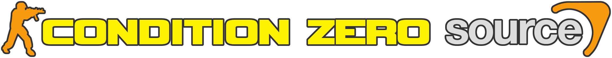
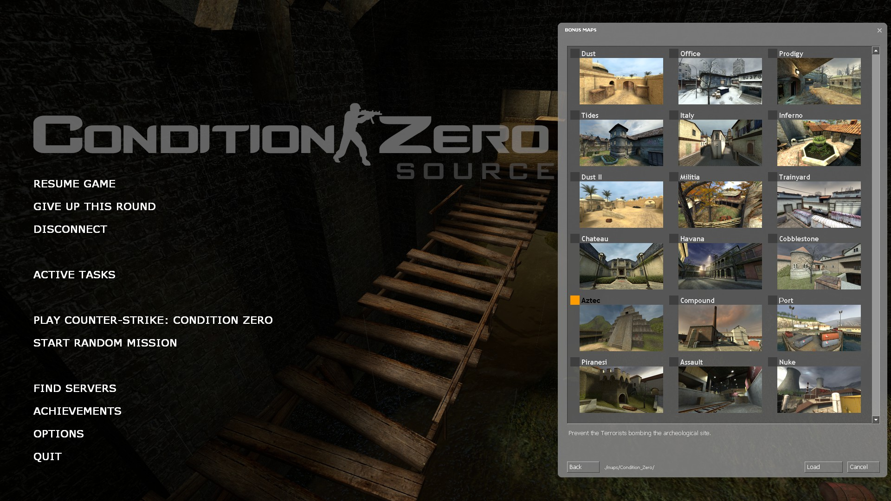
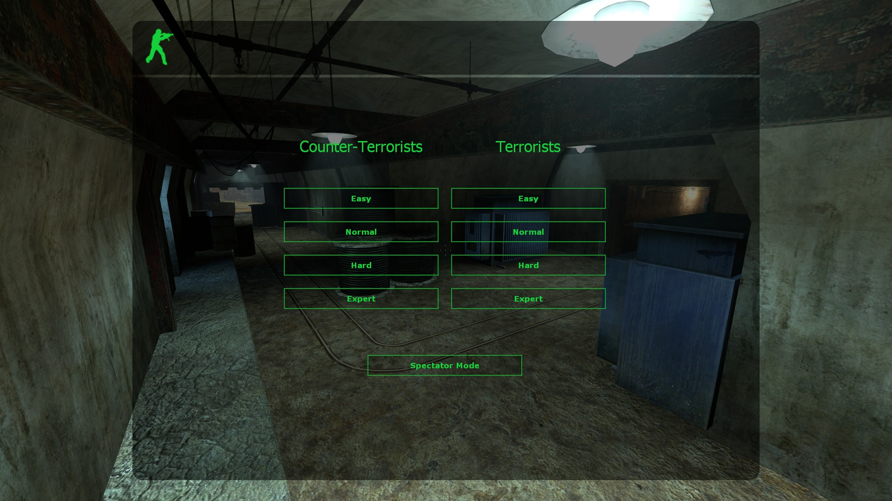
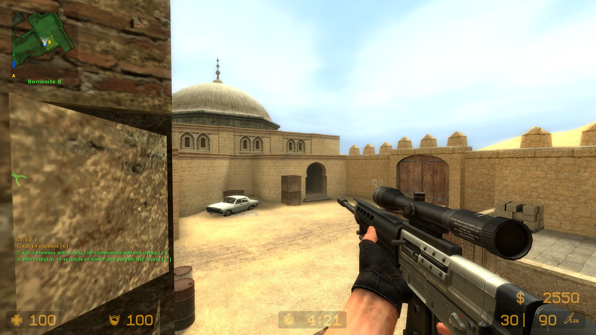
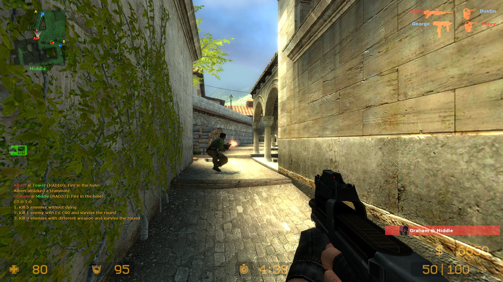

# 

Singleplayer and cooperative PvE mod for **Counter-Strike: Source**, powered by [SourceMod](https://www.sourcemod.net/about.php)

### ✨ Features

- 🏆 Task tracking system from **Counter-Strike: Condition Zero**
- 🎁 Support for custom maps and campaigns
- 🤖 Ability to play as a bot after death
- 🛒 Auto-buy task weapons on `F1`
- 🎖️ **CS:S** achievements availability
- 🎭 Both **CT** & **T** teams playability
- 🎲 Random mission generator
- 💪 Four difficulty levels
- 🎨 Campaign editor
- 👯‍♀️ Co-op support

### 📝 Notes

- 🪟 Compatible with **Windows** and [x64 update](https://steamdb.info/depot/232331/history/?changeid=M:4432809338483152243)
- 👍 Uses [Bot2Player](https://forums.alliedmods.net/showthread.php?t=215830) plugin by [Bittersweet](https://forums.alliedmods.net/member.php?u=181976) - press `E` while spectating any bot-teammate
- ⚠️ Some original game features are simplified:
	- 👥 No ability to assemble team - Difficulty based team composition with predefined count and tasks
	- 🔓 No progress saving - All missions are unlocked
	- 🛡️ No shields - Shield tasks replaced with pistols

### 📷 Screenshots


Game menu and mission browser
<br><br><br>

Difficulty and team selection
<br><br><br>

Campaign task tracking
<br><br><br>

Random generated mission
<br><br><br>
### 💾 Installation

1. Install clean [Counter-Strike: Source](https://store.steampowered.com/app/240/CounterStrike_Source)
2. Install [Condition-Zero-Source.exe](https://github.com/MuxaJlbl4/Condition-Zero-Source/releases/download/1.0/Condition-Zero-Source-1.0.exe)
3. Set `-insecure` launch option for **Counter-Strike: Source** via **Steam** [game properties](Images/insecure.png)
4. Launch **Counter-Strike: Source**

### 🌍 Multiplayer

1. Start any mission
2. Everyone in your **LAN** can join to you by `connect <IP>` or via `FIND SERVERS` -> `LAN`

Additional multiplayer options:

- `sv_lan` - Can help with connection problems
- `sv_password` - Password protection for private game
- See [Coop Commands](#coop-commands) for additional gameplay adjustments

## 💻 Console Commands

### Task Commands

Gameplay tweaks:

- `cz_task_add` - Add a new task (see [Task Arguments](#%EF%B8%8F⃣-task-arguments))
- `cz_task_reset` - Reset all task progress
- `cz_skip` - Forces round end with opposite team win
- `cz_list` - List all active achievement tasks

### Coop Commands

- `cz_bots_per_player` - Number of enemy bots that will be added with each joined extra player (default **1**)
- `cz_simple_coop` - Simplified survival and in-a-row tasks for coop (default **1**)

### Initialisation Commands

Initial values for mission `cfg` files:

- `cz_matchwins` - Minimum number of rounds a team must win in order to win a match (default **3**)
- `cz_matchwinsby` - Number of wins a team must lead by in order to win a match (default **2**)
- `cz_teammates` - Number of teammate bots
- `cz_opponents` - Number of enemy bots

### Cheat Commands

Available with `sv_cheats 1`:

- `cz_victory` - Force match victory
- `cz_defeat` - Force match defeat

### Debug Commands

Miscellaneous:

- `cz_teamchosen` - Is team and difficulty already chosen for this session
- `cz_task_delete` - Delete all tasks
- `cz_version` - Plugin version


## #️⃣ Task Arguments

Usage: **`cz_task_add <type> [arguments]`**

### Task Types

- ⚡ **kill** - Kill a specified amount of enemies:
	- `cz_task_add kill <target> [headshot] [inarow] [survive]`

- 🔫 **killwith** - Kill a specified amount of enemies with mentioned weapon (See **Task Weapons** section):
	- `cz_task_add killwith <target> <weapon> [headshot] [inarow] [survive]`

- 👀 **killblind** - Kill a specified amount of blindfolded enemies:
	- `cz_task_add killblind <target> [headshot] [inarow] [survive]`

- ⏱️ **winfast** - Win a round in less than the specified amount of seconds:
	- `cz_task_add winfast <target> [survive]`

- 🏃‍♂️ **rescue** - Rescue a specified amount of hostages:
	- `cz_task_add rescue <target>`

- 🏃‍♀️ **rescueall** - Win a round by rescuing all hostages:
	- `cz_task_add rescueall`

- 💣 **bomb** - Plant/Defuse the bomb
	- `cz_task_add bomb`

- 🔇 **killsilent** - Kill a specified amount of enemies with silenced weapon or knife
	- `cz_task_add killsilent <target> [headshot] [inarow] [survive]`

- 🎯 **killnoscope** - Kill a specified amount of enemies with an un-zoomed sniper rifle
	- `cz_task_add killnoscope <target> [headshot] [inarow] [survive]`

- 🪽 **killjump** - Kill a specified amount of enemies while you are airborne
	- `cz_task_add killjump <target> [headshot] [inarow] [survive]`

- 🔄 **killvary** - Kill a specified amount of enemies with different weapons
	- `cz_task_add killvary <target> [headshot] [inarow] [survive]`

- ⌛ **killnoreload** - Kill a specified amount of enemies without reloading
	- `cz_task_add killnoreload <target> [headshot] [inarow] [survive]`

- 🎨 **spray** - Tag a specified amount of decals
	- `cz_task_add spray <target>`

### Task Weapons

- Names:

	- **glock** - 9x19mm Sidearm (Glock 19)
	- **usp** - K&M .45 Tactical (H&K USP Tactical)
	- **p228** - 228 Compact (SIG P228)
	- **deagle** - Night Hawk .50c (Desert Eagle)
	- **elite** - .40 Dual Elites (Dual Berettas)
	- **fiveseven** - ES Five-Seven (FN Five-seveN)
	- **m3** - Leone 12 Gauge (Benelli M3 Super 90)
	- **xm1014** - Leone YG1265 Auto (Benelli M4 Super 90)
	- **galil** - IDF Defender (IMI Galil AR)
	- **ak47** - CV-47 (AK-47)
	- **scout** - Schmidt Scout (Steyr Scout)
	- **sg552** - Krieg 552 (SIG SG 552 Commando)
	- **awp** - Magnum Sniper Rifle (AWP)
	- **g3sg1** - D3/AU-1 (H&K G3SG/1)
	- **famas** - Clarion 5.56 (FAMAS F1)
	- **m4a1** - Maverick M4A1 Carbine (M4A1 Carbine)
	- **aug** - Bullpup (Steyr AUG)
	- **sg550** - Krieg 550 Commando (SIG SG 550)
	- **mac10** - Ingram Mac-10 (Ingram MAC-10)
	- **tmp** - Schmidt Machine Pistol (Steyr TMP)
	- **mp5navy** - K&M Sub-Machine Gun (H&K MP5N)
	- **ump45** - K&M UMP45 (H&K UMP45)
	- **p90** - ES C90 (FN P90)
	- **m249** - M249 (FN Minimi)
	- **hegrenade** - HE Grenade
	- **knife** - Combat Knife

- Classes:

	- **pistol** - `glock` `usp` `p228` `deagle` `elite` `fiveseven`
	- **shotgun** - `m3` `xm1014`
	- **smg** - `tmp` `mac10` `mp5navy` `ump45` `p90`
	- **rifle** - `galil` `famas` `m4a1` `ak47` `aug` `sg552`
	- **sniper** - `scout` `sg550` `g3sg1` `awp`
	- **machinegun** - `m249`

Some task weapons automatically swaps depending on player team side:

| **CT** | **T** |
| --- | --- |
| `fiveseven` | `elite` |
| `tmp` | `mac10` |
| `famas` | `galil` |
| `m4a1` | `ak47` |
| `aug` | `sg552` |
| `sg550` | `g3sg1` |

### Additional Conditions

- **headshot** - Task counts only with headshot kill
- **inarow** - Uncompleted task resets, when player dies
- **survive** - Task counts only when player survives till round end

## ✏️ Creating Custom Campaign

1. In the `Editor` folder create a `txt` file with your campaign name as a filename, space symbols should be replaced with `_` (`My_Campaign.txt`), it should contain ordered map names:

```
cs_havana
cs_italy
```

2. Run `Generator.py` this will create folder with your campaign name and necessary files

3. Put your custom maps, navs and all necessary files to `My_Campaign\maps`

4. If required, put your additional map models, materials, folders and etc to `My_Campaign`

5. In `My_Campaign` create logo for your campaign (`TGA` `180x100`):
- `My_Campaign.tga`

6. In `My_Campaign\maps` create logos for maps (`TGA` `180x100`):
- `cs_havana.tga`
- `cs_italy.tga`

7. Adjust mission tasks and cvars by editing generated `cfg` files in `My_Campaign\cfg\My_Campaign`:
- `campaign.cfg`
- `cs_havana.cfg`
- `cs_italy.cfg`

8. Adjust mission names and descriptions by editing generated `bms` files in `My_Campaign\maps\My_Campaign`

9. If required, create and adjust `My_Campaign\cfg\My_Campaign\botprofile.db` for custom bot specs

10. Copy `My_Campaign` folder to `...\Steam\steamapps\common\Counter-Strike Source\cstrike\custom`, your campaign should appear in game mission browser

## 🏗️ Manual Building

1. Install clean [Counter-Strike: Source](https://store.steampowered.com/app/240/CounterStrike_Source)
2. Install latest [Metamod:Source](https://www.sourcemm.net/downloads.php/?branch=master)
3. Install latest [SourceMod](https://www.sourcemod.net/downloads.php?branch=dev)
4. Compile plugins with `compile-condition-zero.bat` and `compile-bot2player.bat`
5. Compile and install INNO file: `Installer.iss`
6. Set game launch options: `-insecure`
